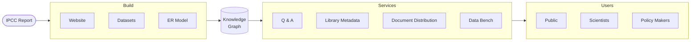
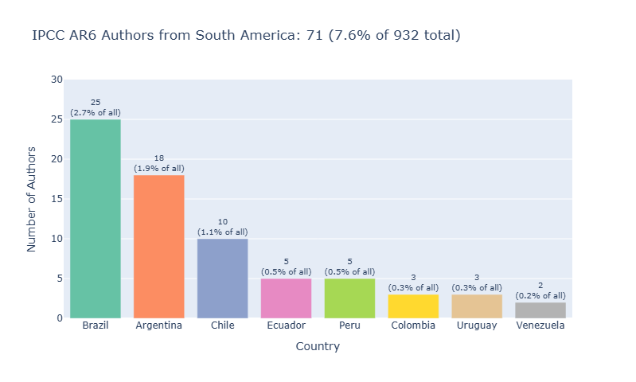
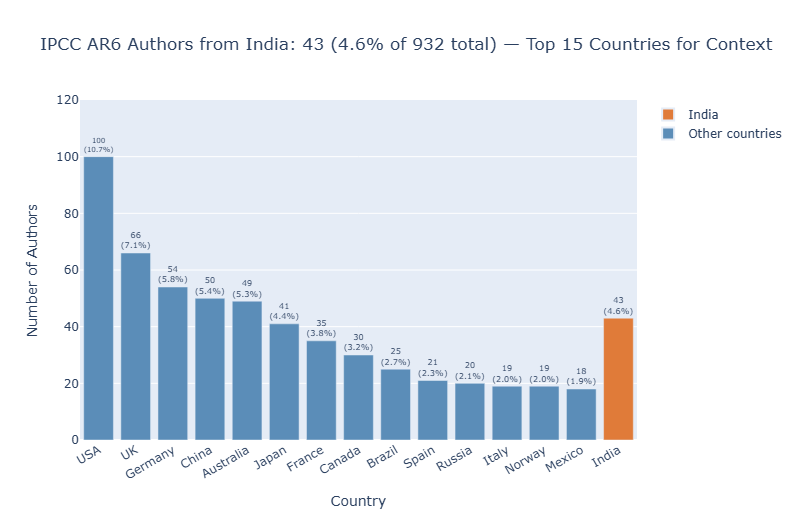
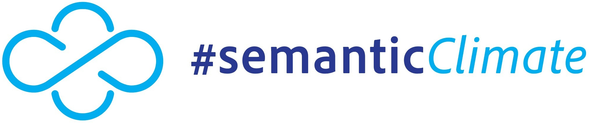

# Climate Knowledge Graph (ClimateKG)

ClimateKG is a literature resource for climate change science. It is intended for use by the public, policymakers, and scientists. The project has made a knowledge graph to help users navigate these complex corpora — to answer questions and access documents.

To start with ClimateKG has imported the 10,000 page corpus [IPCC Sixth Assessment Report (AR6)](https://www.ipcc.ch/assessment-report/ar6/) into the knowledge graph.

On AR6:

> It is a survival guide for humanity. As it shows, the 1.5-degree limit is achievable. <br/> - [UN Secretary-General António Guterres](https://media.un.org/avlibrary/en/asset/d302/d3022200#:~:text=In%20a%20video%20message%20to,1.5%2Ddegree%20limit%20is%20achievable) (2023)

## ClimateKG links

- [ClimateKG:](https://prod-climatekg.semanticclimate.org/) Browse the text and data
- [ClimateKG Data Bench:](https://tibhannover.github.io/ClimateKG-Data-Bench/) Data analysis and community contributions
- [Docs:](https://tibhannover.github.io/climate-knowledge-graph/) Documentation and development log 

## How the knowledge graph is made



The objective is to add a data surface to what is already in the documents and make that knowledge usable.

The AR6 reports on the web are changed into basic **foundational datasets** to show its main parts. Then, connections are made between the parts using an **entity-relationship model**. The data is now a **knowledge graph** and the connected data can be searched.

### Foundational datasets

AR6 has been broken down into five foundational datasets:

| Dataset | Data |
|---|---|
| 1. Corpus full text & structure | 7,524,958 words; 2,153 image files; 88 chapters |
| 2. Bibliographic information | 95 DOIs |
| 3. Glossary | 1,274 terms |
| 4. Acronyms | 1,910 |
| 5. Authors | 932 |

### Entity-relationship model

ClimateKG connects these datasets using an **entity-relationship model**, forming the **knowledge graph**:

```
WORK  <- Corpus structure
+- REPORT_SERIES
   +- REPORT
   |  <- Bibliographic info
   |  <- Glossary
   |  <- Acronyms
   +- TEXT_DIVISION
      +- CHAPTER
         <- Authors
         <- Bibliographic info
         <- Corpus full text
```

## Using the knowledge graph

ClimateKG is a community knowledge graph that supports contributions from the scientic community and engagement from the wider public.

### Searching the knowledge graph

The connections that the knowledge graph creates allow for querying the data. As an example question:

> 'How many South American or Indian authors contributed to the report?'

The knowledge graph knows the answer and can retrieve the relevant chapter texts:

> 'AR6 author distribution is 71 from South America and 43 from India.'

<a href="https://tibhannover.github.io/ClimateKG-Data-Bench/research_data/data-vis/gender-distribution-simple.html#author-geography-south-america-and-india"></a>

<a href="https://tibhannover.github.io/ClimateKG-Data-Bench/research_data/data-vis/gender-distribution-simple.html#author-geography-south-america-and-india"></a>

### What is planned for release

- **Document distribution:** The data provides a map of the internal structure of the corpus documents, enabling any section or piece of data to be retrieved and delivered to the user.
- **Extended metadata:** Questions can be answered quickly and reliably. Metadata is distributed to library systems and the Data Commons on Wikidata.
- **Citizen science:** ClimateKG collaborates with Youth Data Champions interns from the #SemanticClimate organisation on a global scale.
- **Data science community:** Contributors can enrich the corpus while maintaining the integrity of the original documents.

## The ClimateKG project

Inspired by Tim Berners-Lee's vision of the Semantic Web, ClimateKG is a software R&D project that uses **FAIR Principles** and **Open Science infrastructures** to liberate literature on climate change science.

### Funding and support

ClimateKG has been funded by TIB Innovation fund, TIB — Leibniz Information Centre for Science and Technology and University Library of Hannover (ROR ID: [ror.org/04aj4c181](https://ror.org/04aj4c181))

ClimateKG is an R&D project hosted at [TIB](https://www.tib.eu/en) — Leibniz Information Centre for Science and Technology and University Library — Germany, in partnership with [#semanticClimate](https://semanticclimate.github.io/p/en/) and the National Institute of Plant Genome Research [(NIPGR)](https://nipgr.ac.in/nipgrv2/index.html) — India.

### Background

ClimateKG comes out of the #semanticClimate (#sC) open research group founded by Dr. Gitanjali Yadav of [NIPGR](https://nipgr.ac.in/home/home.php), Delhi, Dr Peter Murray-Rust of Cambridge University, and Simon Worthington (TIB). #semanticClimate supports an India-wide internship programme, hackathon series, and youth outreach programme. Web: [https://semanticclimate.github.io/](https://semanticclimate.github.io/)

TIB is one of the largest science libraries in the world and a global hub for knowledge graph R&D, especially the [Open Research Knowledge Graph](https://orkg.org/) (ORKG). ClimateKG partners with Lab Knowledge Infrastructures led by Dr Markus Stocker, and draws on expertise from NFDI4Culture projects: [Wikibase4Research](https://nfdi4culture.de/services/details/wikibase4research.html), [Computational Publishing Service](https://nfdi4culture.de/de/dienste/details/computational-publishing-service.html), and [Antelope](https://service.tib.eu/annotation/) (terminology service).

### Team team

Project lead, Simon Worthington — #bookliberationist and publishing technologist [simon.worthington@tib.eu](mailto:simon.worthington@tib.eu) ORCID iD: [0000-0002-8579-9717](https://orcid.org/0000-0002-8579-9717) | Mastodon: [@mrchristian](https://openbiblio.social/@mrchristian) 

Laura Oldenbourg — data modeling and publishing specialist, ORCID iD: [0009-0003-5070-0099](https://orcid.org/0009-0003-5070-0099).

With support from Markus Stocker, lead of Lab Knowledge Infrastructures.

Thank you for support and contributions to TIB colleagues and #semanticClimate members, volunteers, interns, and hackathon participants.

## Copyright and licences

### IPCC reports

The Climate Knowledge Graph imports content from the seven reports of the IPCC Sixth Assessment Report (AR6) cycle. Reports 1--6 are published by Cambridge University Press under [Creative Commons Attribution-NonCommercial-NoDerivatives 4.0 (CC BY-NC-ND 4.0)](https://creativecommons.org/licenses/by-nc-nd/4.0/). Report 7 (the Synthesis Report) is published by the IPCC directly with all rights reserved; short extracts may be reproduced with full source attribution. See also the [IPCC copyright notice](https://www.ipcc.ch/copyright/).

---

**1. Global Warming of 1.5°C (SR15)**
Special Report on the impacts of global warming of 1.5°C above pre-industrial levels.
Copyright © 2018 Intergovernmental Panel on Climate Change (IPCC).
Published by Cambridge University Press.
License: [CC BY-NC-ND 4.0](https://creativecommons.org/licenses/by-nc-nd/4.0/)
DOI: [10.1017/9781009157940](https://doi.org/10.1017/9781009157940) | [Report](https://www.ipcc.ch/sr15/)

---

**2. Climate Change and Land (SRCCL)**
Special Report on climate change, desertification, land degradation, sustainable land management, food security, and greenhouse gas fluxes in terrestrial ecosystems.
Copyright © 2019 Intergovernmental Panel on Climate Change (IPCC).
Published by Cambridge University Press.
License: [CC BY-NC-ND 4.0](https://creativecommons.org/licenses/by-nc-nd/4.0/)
DOI: [10.1017/9781009157988](https://doi.org/10.1017/9781009157988) | [Report](https://www.ipcc.ch/report/srccl/)

---

**3. The Ocean and Cryosphere in a Changing Climate (SROCC)**
Special Report on observed and projected changes to the ocean and cryosphere and their impacts.
Copyright © 2019 Intergovernmental Panel on Climate Change (IPCC).
Published by Cambridge University Press.
License: [CC BY-NC-ND 4.0](https://creativecommons.org/licenses/by-nc-nd/4.0/)
DOI: [10.1017/9781009157964](https://doi.org/10.1017/9781009157964) | [Report](https://www.ipcc.ch/report/srocc/)

---

**4. Climate Change 2021: The Physical Science Basis (AR6 WGI)**
Working Group I contribution to the Sixth Assessment Report.
Copyright © 2021 Intergovernmental Panel on Climate Change (IPCC).
Published by Cambridge University Press.
License: [CC BY-NC-ND 4.0](https://creativecommons.org/licenses/by-nc-nd/4.0/)
DOI: [10.1017/9781009157896](https://doi.org/10.1017/9781009157896) | [Report](https://www.ipcc.ch/report/sixth-assessment-report-working-group-i/)

---

**5. Climate Change 2022: Impacts, Adaptation and Vulnerability (AR6 WGII)**
Working Group II contribution to the Sixth Assessment Report.
Copyright © 2022 Intergovernmental Panel on Climate Change (IPCC).
Published by Cambridge University Press.
License: [CC BY-NC-ND 4.0](https://creativecommons.org/licenses/by-nc-nd/4.0/)
DOI: [10.1017/9781009325844](https://doi.org/10.1017/9781009325844) | [Report](https://www.ipcc.ch/report/sixth-assessment-report-working-group-ii/)

---

**6. Climate Change 2022: Mitigation of Climate Change (AR6 WGIII)**
Working Group III contribution to the Sixth Assessment Report.
Copyright © 2022 Intergovernmental Panel on Climate Change (IPCC).
Published by Cambridge University Press.
License: [CC BY-NC-ND 4.0](https://creativecommons.org/licenses/by-nc-nd/4.0/)
DOI: [10.1017/9781009157926](https://doi.org/10.1017/9781009157926) | [Report](https://www.ipcc.ch/report/sixth-assessment-report-working-group-3/)

---

**7. Climate Change 2023: Synthesis Report (AR6 SYR)**
Synthesis Report integrating findings from the three Working Group reports and three Special Reports.
Copyright © Intergovernmental Panel on Climate Change, 2023.
ISBN: 978-92-9169-164-7
Published by the IPCC.
License: All rights reserved. The right of publication in print, electronic and any other form and in any language is reserved by the IPCC. Short extracts from this publication may be reproduced without authorization provided that the complete source is clearly indicated. Requests to publish, reproduce or translate should be addressed to: IPCC c/o WMO, 7bis avenue de la Paix, P.O. Box 2300, CH-1211 Geneva 2, Switzerland. E-mail: IPCC-Sec@wmo.int
DOI: [10.59327/IPCC/AR6-9789291691647](https://doi.org/10.59327/IPCC/AR6-9789291691647) | [Report](https://www.ipcc.ch/report/sixth-assessment-report-cycle/)

### ClimateKG data

ClimateKG data is licensed under [Creative Commons Zero v1.0 Universal (CC0 1.0)](https://creativecommons.org/publicdomain/zero/1.0/) — dedicated to the public domain.

### ClimateKG code — Open-source software

Code in this repository is licensed under the [GNU General Public License v3.0 (GPL-3.0)](https://www.gnu.org/licenses/gpl-3.0.html). See [LICENSE](LICENSE).

### ClimateKG design and fonts

Fonts are licensed under the [SIL Open Font License (OFL)](https://openfontlicense.org/).

Design assets are licensed under [Creative Commons Attribution-ShareAlike 4.0 (CC BY-SA 4.0)](https://creativecommons.org/licenses/by-sa/4.0/).

Other design resources under respective open licences.

---

<a href="https://www.tib.eu/en"></a>

<a href="https://semanticclimate.github.io/p/en/"></a>

