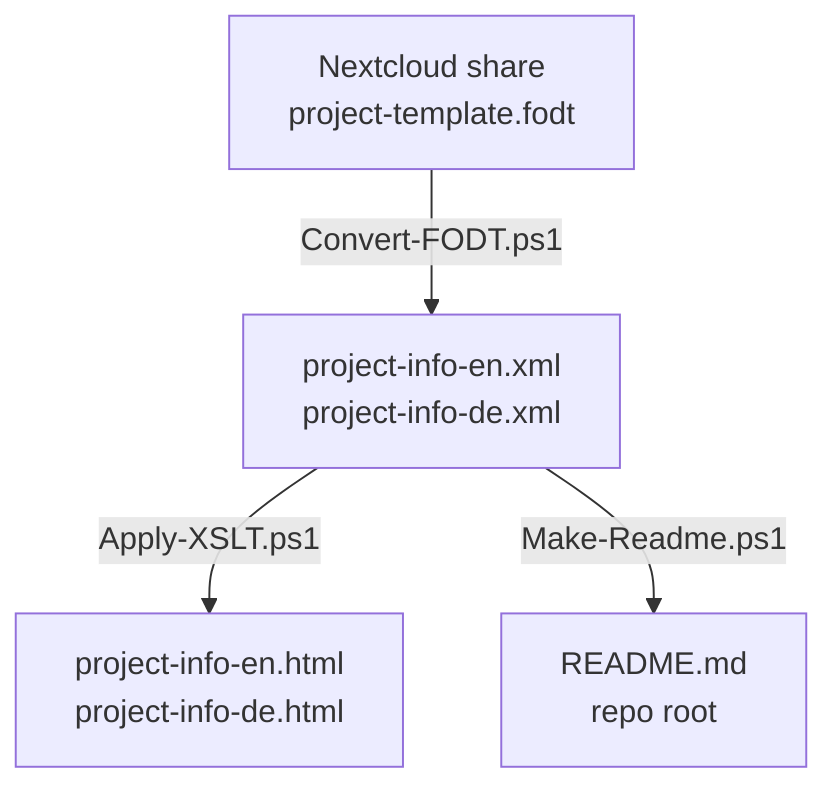

# Project Information Pipeline

This is a way to maintain a single source project description using the
[schema.org `ResearchProject`](https://schema.org/ResearchProject) schema, which can
then output content to any file type or location.

This pipeline turns one bilingual, human-editable source document into a project
webpage and a repository README — for ClimateKG, and reusably for any other repo.

## ClimateKG Files

| Type | File |
|---|---|
| Source (`.fodt`) | [project-info-schema/project-ckg.fodt](project-info-schema/project-ckg.fodt) |
| XML | [project-info-en.xml](project-info-en.xml) · [project-info-de.xml](project-info-de.xml) |
| HTML | [project-info-en.html](project-info-en.html) · [project-info-de.html](project-info-de.html) |
| Output | [Repository README](../README.md) |

---

## How It Works



The scripts, XSLT stylesheets and DTD live in `project-info-schema/`; the generated
XML and HTML sit in `project-info/`; the README is written to the repo root.

---

## Using This Pipeline In Your Own Repository

1. **Create a Nextcloud share** with a copy of `project-template-make-a-copy.fodt`,
   filled in with your project's details in the *Active Project Fields* table.
2. **Copy the `project-info-schema/` folder** (scripts, XSLT, DTD) into your repo.
3. **Generate XML** from your Nextcloud share:
   ```powershell
   cd project-info-schema\scripts
   .\Convert-FODT.ps1 -ShareUrl https://your-nextcloud/s/yourshareid
   ```
4. **Generate the HTML webpage:**
   ```powershell
   .\Apply-XSLT.ps1
   ```
5. **Generate your repo's README:**
   ```powershell
   .\Make-Readme.ps1
   ```
6. Whenever the FODT content changes, re-run steps 3–5.

---

## Reference

### Field Conventions in the FODT Table

| Field | Convention in EN/DE cells |
|---|---|
| `name`, `alternateName`, `url`, `keywords` | Plain text in one paragraph |
| `description`, `knowsAbout` | One paragraph per item |
| `sameAs` | One URL per paragraph |
| `identifier` | Line 1: display text · Line 2: `propertyID="..." value="..."` |
| `image → imageObject` | Alternating caption / URL pairs (EN); DE: `URLs (= EN)` then `DE captions:` then captions |
| `foundingDate / dissolutionDate` | `Start: YYYY` and `End: YYYY` |
| `parentOrganization` | Line 1: org name · Line 2: `ROR: https://...` |
| `member` | Alternating name / `ORCID: 0000-...` pairs |
| `memberOf` | EN: alternating name / `ROR:` or URL pairs · DE: names only (hrefs taken from EN) |
| `funding` | `Label:` / value alternating pairs (`Name:`, `Grant ID:`, `Funder:`, `URL:`) |
| `knowsLanguage` | `code (Language name)` per paragraph, e.g. `en (English)` |
| `hasCredential` | Groups of three paragraphs: name · description · URL |

Write `(= EN)` in a DE cell for fields that don't need translation.

### Schema.org → Wikidata Property Mapping

| XML field | Wikidata property | Notes |
|---|---|---|
| `name` | P1476 (title) | Use monolingual text with language tag |
| `description` | description field | Wikidata descriptions are short (< 250 chars) — use `disambiguatingDescription` |
| `alternateName` | P4970 (alternative name) | |
| `url` | P856 (official website) | |
| `sameAs` | P2888 (exact match) | |
| `identifier` (GrantID) | P8329 (project grant ID) | |
| `foundingDate` | P571 (inception) | |
| `dissolutionDate` | P576 (dissolved/abolished) | |
| `parentOrganization` (Lead) | P361 (part of) | |
| `memberOf` (Partner) | P361 (part of) or P664 (organizer) | |
| `member` | P710 (participant) | Link to person's Wikidata item via ORCID |
| `funder` | P8324 (funded by) | |
| `keywords` | P921 (main subject) | Create as separate Wikidata items where possible |

### DTD and Schema

- **Schema**: <https://schema.org/ResearchProject> (Thing → Organization → Project → ResearchProject)
- **DTD**: `ResearchProject.dtd` (Schema Version 30.0, 2026-03-19) — <https://gitlab.com/TIBHannover/open-science-lab/pip/-/blob/main/ResearchProject.dtd>
- **ODF spec**: <https://docs.oasis-open.org/office/OpenDocument/v1.3/> — `.fodt` is a Flat ODF Text document, a plain XML file editable in LibreOffice Writer.

### Adding a New Field

1. Add the field row to the FODT's Active Fields table.
2. Add a parsing block in `Convert-FODT.ps1` and the matching XML output in `Build-XML`.
3. Add a rendering block to `ResearchProject.xslt` (HTML) and/or `ResearchProject-readme.xslt` (README).
4. Update this file with the new field's downstream mapping.
